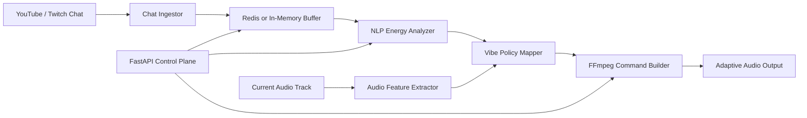

# Auralis ML

Real-Time Stream Vibe Engine: an autonomous audio modulation pipeline that listens to live chat, estimates audience energy with NLP, and drives FFmpeg-based audio transformations for adaptive 24/7 streams.

## Why This Exists

Most online radio stations and always-on creator streams rely on static playlists or constant human moderation to keep the room alive. Auralis ML turns the audience into a control signal: when chat sentiment, intensity, and message velocity rise, the engine can lift tempo, emphasize bass, or move into a more intense sonic profile. When the room cools down, it softens EQ and ambience.

The project is built as an end-to-end ML/MLOps portfolio system, not as a notebook. It includes live ingestion, NLP inference, audio feature extraction, FFmpeg orchestration, a FastAPI control plane, Docker packaging, and CI.

## Architecture



## Features

- Live chat ingestion adapters for demo streams, YouTube via `pytchat`, and Twitch IRC.
- Rolling 30-second chat windows with Redis support and a local in-memory fallback.
- Sentiment and energy scoring with Hugging Face Transformers when installed, plus a deterministic lexical fallback for lightweight CI and local demos.
- Audio BPM/key/energy feature extraction with Librosa when installed.
- FFmpeg filter graph generation for tempo, pitch, bass, treble, compressor, and reverb profiles.
- FastAPI service with health, single/batch ingest, energy, vibe profile, and FFmpeg preview endpoints.
- Docker and Docker Compose setup with FFmpeg installed on Ubuntu.
- GitHub Actions CI for linting and tests.

## Quick Start

```bash
docker compose up --build
```

Open:

- API: http://localhost:8000
- Docs: http://localhost:8000/docs

Send sample chat messages:

```bash
curl -X POST http://localhost:8000/chat \
  -H "Content-Type: application/json" \
  -d '{"author":"viewer42","message":"This is insane, speed it up","platform":"demo"}'
```

Preview the generated FFmpeg plan:

```bash
curl "http://localhost:8000/engine/preview?input=examples/input.wav&output=examples/output.wav"
```

Inspect the active vibe profile without building a command:

```bash
curl http://localhost:8000/engine/profile
```

## Local Development

```bash
python -m venv .venv
source .venv/bin/activate
pip install -e ".[dev]"
uvicorn auralis_ml.api.app:create_app --factory --reload
```

Optional ML/audio extras:

```bash
pip install -e ".[ml,audio,chat]"
```

## Configuration

Environment variables:

| Variable | Default | Description |
| --- | --- | --- |
| `AURALIS_WINDOW_SECONDS` | `30` | Rolling chat window size used for energy scoring. |
| `AURALIS_REDIS_URL` | empty | Redis URL. If omitted, the service uses an in-memory buffer. |
| `AURALIS_SENTIMENT_MODEL` | `cardiffnlp/twitter-roberta-base-sentiment-latest` | Hugging Face sentiment model. |
| `AURALIS_ENABLE_TRANSFORMERS` | `false` | Enables Transformers inference when dependencies are installed. |
| `AURALIS_TWITCH_CHANNEL` | empty | Twitch channel for the Twitch ingestor. |
| `AURALIS_TWITCH_NICK` | empty | Twitch bot/user nick. |
| `AURALIS_TWITCH_TOKEN` | empty | Twitch OAuth token. |
| `AURALIS_YOUTUBE_VIDEO_ID` | empty | YouTube video ID for `pytchat`. |

## Example Engine Behavior

| Chat Energy | Sentiment | Audio Profile |
| --- | --- | --- |
| Low | Calm or negative | Lower tempo, softer highs, light reverb. |
| Medium | Neutral or mixed | Keep tempo stable, mild compression, balanced EQ. |
| High | Positive and fast | Raise tempo, boost bass, add presence, optional nightcore pitch shift. |
| Very high | Intense spike | Aggressive BPM lift, bass isolation emphasis, limiter protection. |

## Running Tests

```bash
pytest
```

## FFmpeg Execution

The API currently exposes safe command previews. To run an actual transformation locally:

```bash
python scripts/render_audio.py examples/input.wav examples/output.wav --energy 0.82
```

The renderer validates paths, builds a deterministic FFmpeg graph, and streams progress through FFmpeg.

## Roadmap

- WebSocket telemetry dashboard for live energy curves.
- Beat-aligned crossfades between subgenre queues.
- Demucs stem separation pipeline for bass/vocal/drum-aware transformations.
- Twitch EventSub integration.
- Prometheus metrics and production deployment manifests.

## License

MIT License. See [LICENSE](LICENSE).
